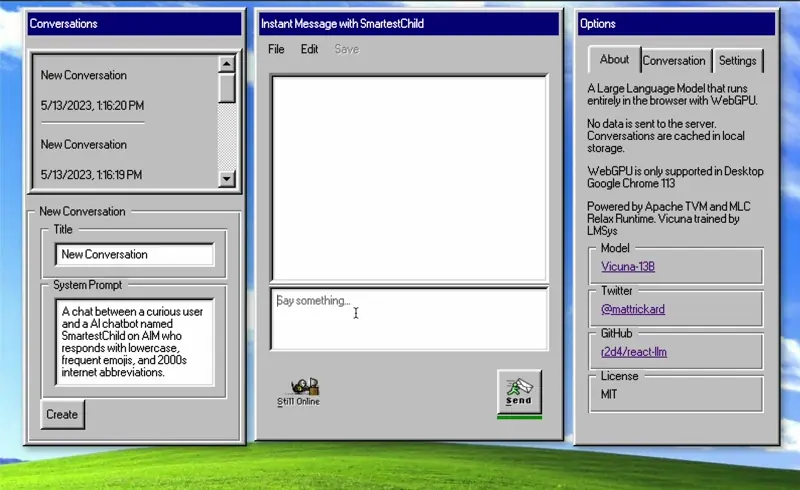

# @react-llm/headless

Easy-to-use headless React Hooks to run LLMs in the browser with WebGPU. As simple as `useLLM()`.

### [**Live Demo**](https://chat.matt-rickard.com)



**Features**:

* Supports [Vicuna 7B](https://lmsys.org/blog/2023-03-30-vicuna/)
* Use custom system prompts and "user:"/"assistant:" role names
* Completion options like `max tokens` and `stop sequences`
* No data leaves the browser. Accelerated via WebGPU.
* Hooks built to 'Bring your own UI'
* Persistent storage for conversations in browser storage. Hooks for loading and saving conversations.
* Model caching for faster subsequent loads

## Installation

```bash
npm install @react-llm/headless
```

## Packages in this repository
- [@react-llm/model](packages/model) - The LLM model and tokenizer compiled for the browser
- [@react-llm/retro-ui](packages/retro-ui) - Retro-themed UI for the hooks
- [@react-llm/extension](packages/extension) - Chrome Extension that uses the hooks
- [@react-llm/headless](packages/headless) - Headless React Hooks for running LLMs in the browser


## **useLLM** API
### Types
```typescript
// Model Initialization
init: () => void;

// Model Generation
send: (msg: string, maxTokens: number, stopSequences: string[]) => void;
onMessage: (msg: GenerateTextResponse) => void;
setOnMessage: (cb: (msg: GenerateTextResponse) => void) => void;

// Model Status
loadingStatus: InitProgressReport;
isGenerating: boolean;
gpuDevice: GPUDeviceInfo;

// Model Configuration
userRoleName: string;
setUserRoleName: (roleName: string) => void;
assistantRoleName: string;
setAssistantRoleName: (roleName: string) => void;

// Conversation Management
conversation: Conversation | undefined;
allConversations: Conversation[] | undefined;
createConversation: (title?: string, prompt?: string) => void;
setConversationId: (conversationId: string) => void;
deleteConversation: (conversationId: string) => void;
deleteAllConversations: () => void;
deleteMessages: () => void;
setConversationTitle: (conversationId: string, title: string) => void;
```

### Hooks
```typescript
import useLLM from '@react-llm/headless';

const MyComponent = () => {
  const {
    conversation,
    allConversations,
    loadingStatus,
    isGenerating,
    createConversation,
    setConversationId,
    deleteConversation,
    deleteAllConversations,
    deleteMessages,
    setConversationTitle,
    onMessage,
    setOnMessage,
    userRoleName,
    setUserRoleName,
    assistantRoleName,
    setAssistantRoleName,
    gpuDevice,
    send,
    init,
  } = useLLM();

  // Component logic...

  return null;
};
```


### Packages

* `@react-llm/headless` - Headless React Hooks for running LLMs in the browser
* `@react-llm/retro-ui` - Retro-themed UI for the hooks

## How does it work?

This library is a set of React Hooks that provide a simple interface to run LLMs in the browser. It uses Vicuna 13B.

* SentencePiece tokenizer (compiled for the browser via Emscripten)
* Vicuna 7B (transformed to Apache TVM format)
* Apache TVM and MLC Relax (compiled for the browser via Emscripten)
* Off-the-main-thread WebWorker to run the model (bundled with the library)


The model, tokenizer, and TVM runtime are loaded from a CDN (huggingface). The model is cached in browser storage for faster subsequent loads.


### Example
See [packages/retro-ui](packages/retro-ui) for the full demo code. This is a simple example of how to use the hooks. To run it, after cloning the repo,

```bash
cd packages/retro-ui
pnpm install
pnpm dev
```


### License
MIT

The code under `packages/headless/worker/lib/tvm` is licensed under Apache 2.0.
